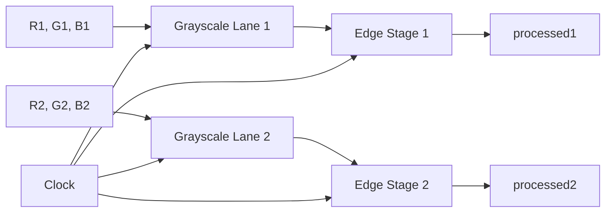

# Dual-Lane Video Processing Pipeline in VHDL

A clocked video-processing prototype implemented in **VHDL** and tested with **Xilinx Vivado**. The design accepts two 24-bit RGB pixels in parallel, converts both pixels to grayscale, and passes the grayscale values through a simplified Sobel-style edge-processing stage.

The repository also includes a file-driven VHDL testbench, sample RGB video frames, and generated output data.

## Overview

The top-level design contains two identical processing lanes:

```text
RGB Pixel 1 ──> Grayscale 1 ──> Edge Stage 1 ──> processed1
RGB Pixel 2 ──> Grayscale 2 ──> Edge Stage 2 ──> processed2
                         Clocked pipeline
```

Processing two pixels in parallel demonstrates a simple form of data-level parallelism suitable for higher-throughput image and video pipelines.

## Features

- Two parallel RGB pixel-processing lanes
- 8-bit red, green, and blue input channels per lane
- Weighted RGB-to-grayscale conversion
- Clocked edge-processing stage
- Modular VHDL architecture
- TextIO-based simulation testbench
- Frame-oriented hexadecimal input and output files
- Developed and simulated in Xilinx Vivado

## Grayscale Conversion

Each RGB pixel is converted to an 8-bit grayscale value using the standard weighted luminance approximation:

```text
Gray = (299 × R + 587 × G + 114 × B) / 1000
```

This gives greater weight to the green channel and lower weight to the blue channel, approximating human visual sensitivity.

## Architecture



### Top-Level Interface

| Port | Direction | Width | Description |
|---|---:|---:|---|
| `clk` | Input | 1 bit | Pipeline clock |
| `R1`, `G1`, `B1` | Input | 8 bits each | RGB channels for the first pixel |
| `R2`, `G2`, `B2` | Input | 8 bits each | RGB channels for the second pixel |
| `processed1` | Output | 8 bits | Processed result for the first lane |
| `processed2` | Output | 8 bits | Processed result for the second lane |

## Repository Structure

```text
VideoPipeline/
├── VideoPipeline.vhd          # Top-level dual-lane pipeline
├── Grayscale.vhd              # Clocked RGB-to-grayscale module
├── EdgeDetection.vhd          # Clocked edge-processing prototype
├── Testbench.vhd              # File-driven simulation testbench
├── video_frames.txt           # Sample RGB frame data
└── processed_video_frames.txt # Example generated output
```

## Module Description

### `VideoPipeline.vhd`

The top-level entity instantiates:

- Two `Grayscale` modules
- Two `EdgeDetection` modules

Both lanes operate in parallel and share the same clock.

### `Grayscale.vhd`

This module:

- Receives one 24-bit RGB pixel as three 8-bit channels
- Computes an 8-bit grayscale intensity
- Registers the result on the rising edge of `clk`

### `EdgeDetection.vhd`

This module contains Sobel coefficient definitions and a clocked gradient-magnitude datapath.

> **Implementation note:** the current module reuses a single grayscale sample in its coefficient expressions and does not maintain a complete 3×3 pixel neighborhood. It is therefore a simplified Sobel-style pipeline prototype, not a complete spatial Sobel convolution. A full implementation would require line buffers, a 3×3 sliding window, and valid-data alignment.

### `Testbench.vhd`

The testbench:

- Generates a 100 MHz clock with a 10 ns period
- Reads hexadecimal RGB pixels from `video_frames.txt`
- Sends two pixels to the pipeline in parallel
- Writes processed values to `processed_video_frames.txt`
- Preserves frame markers in the output

## Input Data Format

The included input contains 14 sample frames, numbered from `0` to `13`. Each frame is represented as a 10×10 grid of 24-bit RGB pixels.

A frame begins with:

```text
# Frame 0
```

Each pixel is represented by six hexadecimal digits:

```text
RRGGBB
```

Example:

```text
4F4A4C
```

corresponds to:

```text
R = 0x4F
G = 0x4A
B = 0x4C
```

## Output Data Format

Each processing lane produces an 8-bit value. The testbench writes each result as a six-character hexadecimal field, for example:

```text
000074
```

The significant processed value is the least-significant byte:

```text
0x74
```

## Running the Simulation in Vivado

### 1. Create a project

1. Open **Xilinx Vivado**.
2. Select **Create Project**.
3. Create an RTL project.
4. Device selection is not critical for behavioral simulation.

### 2. Add design sources

Add the following files as **Design Sources**:

```text
VideoPipeline.vhd
Grayscale.vhd
EdgeDetection.vhd
```

Set `VideoPipeline` as the design top module if Vivado does not detect it automatically.

### 3. Add simulation sources

Add the following as **Simulation Sources**:

```text
Testbench.vhd
video_frames.txt
```

Set `Testbench` as the simulation top module.

### 4. Update the file paths

The supplied testbench contains machine-specific absolute Windows paths:

```vhdl
file video_file : text open read_mode is
    "C:/Users/Javad/Desktop/video_frames.txt";

file output_file : text open write_mode is
    "C:/Users/Javad/Desktop/processed_video_frames.txt";
```

Replace them with paths valid on your system before running the simulation.

For example:

```vhdl
file video_file : text open read_mode is
    "D:/Projects/VideoPipeline/video_frames.txt";

file output_file : text open write_mode is
    "D:/Projects/VideoPipeline/processed_video_frames.txt";
```

### 5. Run behavioral simulation

1. Select **Run Simulation → Run Behavioral Simulation**.
2. Run the simulation for approximately:

```text
10 us
```

The included data requires several hundred clock cycles. The testbench waits indefinitely after reaching the end of the input file, so the simulation should be stopped manually after processing completes.

### 6. Inspect the results

Review:

- `processed1` and `processed2` in the waveform viewer
- The generated `processed_video_frames.txt` file
- The pipeline behavior at clock edges

## Timing Notes

All processing modules are clocked. Therefore:

- Outputs are not combinational responses to the current inputs.
- The first output cycles may be undefined because the design has no reset signal.
- Processed values appear after pipeline latency.
- The current testbench does not include a `valid` signal to align input pixels with output samples.
- File output may therefore be shifted by startup and pipeline latency.

## Vivado and Synthesis Considerations

The source is suitable for behavioral simulation and architectural experimentation. For an FPGA-oriented implementation, consider the following:

- Constant division by `1000` in the grayscale module may consume additional hardware, depending on Vivado optimization.
- A complete Sobel filter requires line buffers and a 3×3 neighborhood generator.
- Reset, enable, and valid signals should be added for deterministic startup and stream alignment.
- Input and output handshaking would make the module easier to integrate with AXI4-Stream.
- Bit widths should be expanded or saturated where intermediate gradient values may overflow.
- Timing constraints and a target FPGA part should be added before evaluating maximum frequency or resource usage.

No FPGA utilization, timing, or power results are included in the current repository, so no implementation metrics are claimed here.

## Academic Context

This project was developed as a VHDL video-processing exercise using Xilinx Vivado. It demonstrates:

- RTL modularization
- Clocked datapath design
- Parallel pixel processing
- Fixed-point arithmetic
- File-based VHDL simulation
- Basic image-processing concepts
